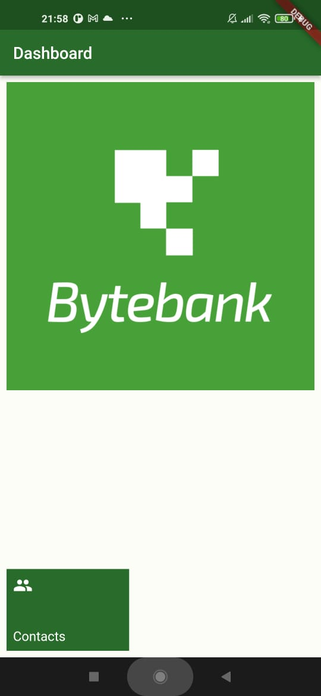

# ByteBank2  

Projeto do ByteBank na Alura feito em **Flutter**, desta vez com **permanência de dados**.

 

## Tabela de conteúdos

<!--ts-->
   * [O Aplicativo](#o-aplicativo)
   * [Telas](#telas)
     * [Dashboard](#dashboard)
     * [Lista de Contatos](#lista-de-contatos)
     * [Criação de Contatos](#criação-de-contatos)
  
<!--te-->

## O Aplicativo

Trata-se de um gerenciador de contatos, onde o usuário pode criar contatos com nome e número da conta, podendo visualizá-los em uma lista. Além disso, os dados permanecem mesmo que o aplicativo seja fechado, pois, utilizando o <a href='https://pub.dev/packages/sqflite'>sqflite</a>, foi possível criar um banco de dados local que guarda as informações inseridas.

## Telas

<table style="width:100%;">
  <tr>
    <td style="width:50%;">
      <h3>Dashboard</h3>
      
Aqui o usuário se depara com o logo do banco e com o botão Contacts, que o leva para sua lista de contatos

    </td>
    <th style="width:50%;">
      
    </th>
  </tr>
  <tr>
    <td style="width:50%;">
      <h3>Lista de Contatos</h3>
      
Aqui o usuário se depara com o logo do banco e com o botão Contacts, que o leva para sua lista de contatos

    </td>
    <th style="width:50%;">
      
    </th>
  </tr>
  <tr>
    <td style="width:50%;">
      <h3>Criação de Contatos</h3>
      
Aqui o usuário se depara com o logo do banco e com o botão Contacts, que o leva para sua lista de contatos

    </td>
    <th style="width:50%;">
      
    </th>
  </tr>
</table>
